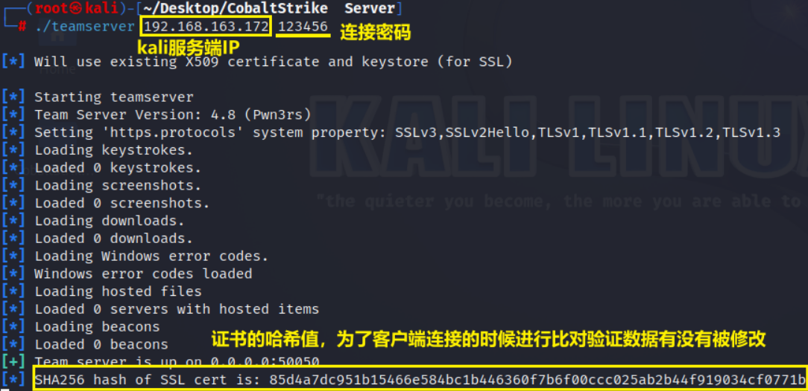
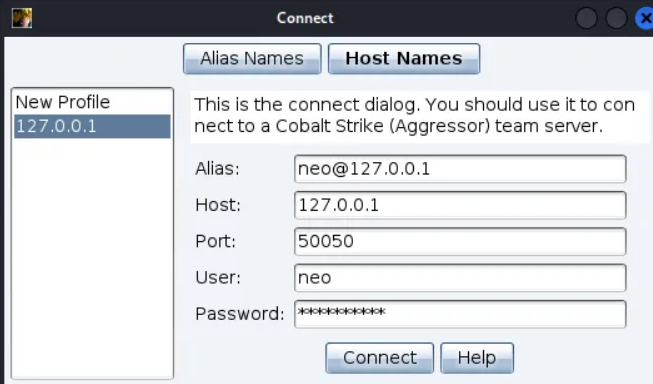
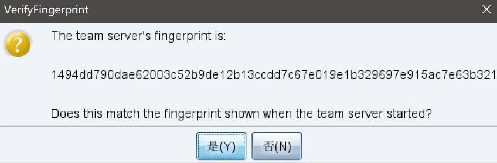
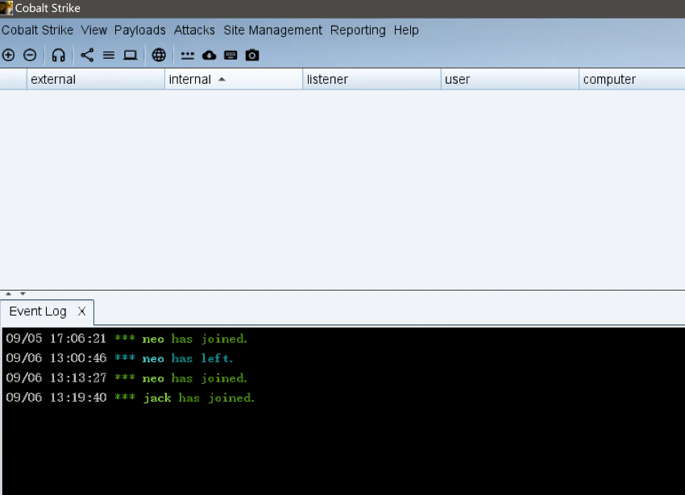

Cobalt Strike4.8  

## Cobalt Strike简介：  
Cobalt Strike是一款由java编写的全平台多方协同渗透测试框架，在3.0版本之前它基于Metasploit框架工作，在3.0后的版本以独立成一个渗透测试平台。CobaltStrike集成了端口转发、端口扫描、socket代理、提权、钓鱼、远控木马等功能。该工具几乎覆盖了APT攻击链中所需要用到的各个技术环节，且其最大的优点在于可以进行团队合作和优越的UI界面。Strike基于Java环境开发，所以一定要安装Java环境。（工具的组成为服务端 + 客户端）

## 一、Cobalt Strike部署

### 服务端  
启动Cobalt Strike需要JDK的支持，需要安装Java环境，如果服务端是kali，默认安装了java环境  
文件复制进linux服务器  
执行`ls -l` 查看TeamServer跟TeamServerImage是否有执行权限  
如果TeamServer跟TeamServerImage不具备x执行权限，执行如下命令添加执行权限  
`sudo chmod +x teamserver TeamServerImage`  
启动服务端：  
`sudo ./teamserver 192.168.163.172 cspasswd`  
这里填本机ip地址跟密码,默认端口为50050  

### 客户端  
windows运行客户端，也需要有JDK环境  
运行cobaltstrike-client.cmd文件  
输入对应服务端上设置的Host Port User Password  

  
Alias：输入主机别名或使用默认值，不能为空或以*开头。  
Host：指定团队服务器的IP地址，不能为空  
Port：服务器的端口（默认为50050）  
User：你在团队服务器上的昵称，不能为空。  
Password：连接到服务器的密码  

第一次用连接到此团队服务器, 会弹出确认指纹  
Cobalt Strike将询问你是否识别此团队服务器的SHA256哈希,指纹校验的主要作用是防篡改  
点击是,连接登录到服务端并打开客户端用户界面   

  

  

如果连接不上，查看服务端防火墙是否开启默认端口或者指定的端口  

Cobalt Strike将会记住这个SHA256哈希值,以便将来连接.可以通过Cobalt Strike -> Preferences -> Fingerprints 来管理这些哈希值。  

## 二、隐藏特征码-服务端(免杀手法之一)  
开启禁Ping动作、修改CS默认端口、修改CS默认证书、C2profile混淆流量、nginx反向代理、套cdn

### 1、开启禁Ping动作:  
        命令: sudo vim /etc/sysctl.conf
        添加一行: net.ipv4.icmp_echo_ignore_all = 1
        刷新配置: sudo sysctl -p

### 2、修改CS默认端口:  
        cd到cs服务端: cd CobaltStrike4.8/Server
        编辑teamserver文件: vim teamserver
        修改port=50050为其他端口
        如果有防火墙记得开放规则: sudo ufw allow 19001

### 3、修改CS默认证书:    
Cobalt Strike默认证书中含有与cs相关的特征，已经被waf厂商标记烂了，我们要重新生成一个新的证书，这里我们用JDK自带的keytool证书工具来生成新证书  

keytool是一个Java数据证书的管理工具，参数如下：  
    -keystore 生成的store名  
    -storepass 指定更改密钥库的储存口令  
    -keypass 指定更改条目的密钥口令  
    -genkey -keyalg RSA 指定算法  
    -alias 自定义别名  
    -dname 指定所有者信息  

删除原有证书，生成新的证书  
删除服务端Server目录下的cobaltstrike.store文件:  
    `sudo rm -rf cobaltstrike.store`   
利用keytool生成新的一个无特征的证书文件  
    `keytool -keystore cobaltstrike.store -storepass 123456 -keypass 123456 -genkey -keyalg RSA -alias 360.com -dname "CN=Microsoft Windows, OU=MOPR, O=Microsoft Corporation, L=Redmond, ST=Washington, C=US"`  
查看cs证书文件内容：`sudo keytool -list -v -keystore cobaltstrike.store`    

修改teamserver里面的证书文件名keyStore以及证书密码keyStorePassword的值,改成自己生成的！如果生成的是cobaltstrike.store跟123456就不需要改  

### 4、C2profile混淆流量:  
Github上已经有非常多优秀的C2-Profile可以供我们使用了，我们需要使用Profile让Beacon和Teamserver之间的交互看起来尽可能像正常的流量  

https://github.com/rsmudge/Malleable-C2-Profiles  
https://github.com/rsmudge/Malleable-C2-Profiles/blob/master/normal/amazon.profile  
https://github.com/threatexpress/malleable-c2    

修改Beacon与cs通信时候的流量特征，创建一个c2.profile文件(名字任意)   
`sudo touch c2.profile`  

​这里我使用的是后者jquery的profile  
创建一个c2.profile文件(文件名任意)  
把jquery-c2.4.8.profile的模板复制进c2.profile,(可自由修改部分内容,没有配置cdn可以不写keyStore跟password)   
`sudo vim c2.profile`    

然后使用c2.profile方式启动teamserver   
`sudo ./teamserver 192.168.2.96 passwd332 c2.profile`   

验证：触发木马-抓包-查看流量特征,发现请求改成了我们在c2.profile中编写的URL、UA等信息时，则修改成功。   

### 5、部署nginx反向代理:   
nginx反代用来隐藏C2服务器，把cs监听端口给隐藏起来了，要不然默认geturi就能获取到我们的shellcode，加密shellcode的密钥又是固定的(3.x 0x69，4.x 0x2e)，所以能从shellcode中解出c2域名等配置信息。  

不修改这个特征的话nmap 一扫就出来:  `nmap [ip] -p [port] --script=grab_beacon_config.nse`  

修改这个特征有两个方法:  
1.修改源码加密的密钥  

2.限制端口访问，让一般的扫描器扫不出来  

这里我们用nginx做反向代理，通过ua过滤流量，然后防火墙限制端口只能让127.0.0.1访问shellcode端口

先到我们的服务器上安装nginx服务，kali自带  

找到nginx安装路径:`whereis nginx`  

打开nginx配置文件 `vim /etc/nginx/sites-available/default` kali自带的nginx配置文件在这个位置，具体看个人的nginx安装位置  

在http中的server中配置中添加   

	location ~*/jquery {
        	if ( $http_user_agent != "Mozilla/5.0 (Windows NT 6.3; Trident/7.0; rv:11.0) like Gecko"){
            		return 404;
        	}
            proxy_set_header X-Forwarded-For $proxy_add_x_forwarded_for;
            proxy_pass http://127.0.0.1:12095;
	}

配置中的ua根据你的profile文件中设置的useragent所定，profile中的ua也可以自行修改  
重启nginx: `sudo service nginx restart`

设置防火墙只能让127.0.0.1访问监听端口  

        iptables
        iptables -I INPUT -p TCP --dport 12095 -j DROP
        iptables -I INPUT -s 127.0.0.1 -p TCP --dport 12095 -j ACCEPT
        service iptables restart
        
        ufw
        sudo ufw allow from 127.0.0.1 to any port 12095

### 6、配置cdn：对c2反连的隐藏，连接的时候发送到cdn里，cdn再发给母体，这样查不到母体ip地址  
做了反代,识别不到是cs，但是连接的ip仍然暴露，这时候就需要做cdn，隐藏自己真实ip    
购买一个域名，解析到cloudflare的dns，打开cdn模式，创建证书，禁用缓存

1）、生成p12证书文件   

    openssl pkcs12 -export -in /opt/ssl/cf.pem -inkey /opt/ssl/cf.key -out spoofdomain.p12 -name 你自己的域名 -passout pass:自己设置一个密码123456

    keytool -importkeystore -deststorepass 刚才设置的密码 -destkeypass 刚才设置的密码 -destkeystore cf.store -srckeystore spoofdomain.p12 -srcstoretype PKCS12 -srcstorepass 刚才设置的密码

将生成的cf.store放到cs server目录下，修改teamserver文件最后一行,修改server_port、keyStore和keyStorePassword(证书名、证书密码、端口号不要用默认的)，例：cobaltstrike.store修改为cf.store     

检查store有效性：`keytool -list -v -keystore cf.store`  
看到cf相关证书即成功  

2）、将keystore加入C2profile中(C2profile混淆流量)  

cs的http相关流量特征可以根据profile文件改变。
以下提供相关配置profile，方便之后的配置使用，虽然github中有很多profile案例，但切记不能直接套用，现在的C2扫描器可以针对常用的几个profile直接扫描，建议自行设置一个复杂的url路径。以下的profile文件根据github上jQuery的profile做了少许修改  
profile：https://github.com/safe8999/safeNotes/CS/c2.profile  

    https-certificate {
        set keystore "cf.store";
        set password "刚才设置的store密码";
    }  

    修改对应HOST、Referer、其他地方自定义  
 
3）、配置nginx代理转发: `vim /etc/nginx/sites-available/default`  

    server {
            listen 443 ssl http2;
            server_name abc123.com; # 你的域名
            ssl_certificate /opt/ssl/cf.pem;
            ssl_certificate_key /opt/ssl/cf.key;

            # 下面写profile中的get的url路径
            location ~*/jquery {
                # 下面写上profile中配置的ua
                if ( $http_user_agent != "Mozilla/5.0 (Windows NT 6.3; Trident/7.0; rv:11.0) like Gecko"){
                    return 404;
                }
                proxy_set_header X-Forwarded-For $proxy_add_x_forwarded_for;
                proxy_pass http://127.0.0.1:19000;
            }

            # 下面写profile中的post的url路径
            location ~*/post {
                # 下面写上profile中配置的ua
                if ($http_user_agent != "Mozilla/5.0 (Windows NT 6.3; Trident/7.0; rv:11.0) like Gecko") {
                    return 302;
                }
                proxy_set_header X-Forwarded-For $proxy_add_x_forwarded_for;
                proxy_pass http://127.0.0.1:19000;
            }

            # 重定向其他所有请求，防止扫描器扫描
            location / {
                proxy_pass  https://www.google.com/;
            }
    }

这一步中，我们使用nginx将443的端口流量转发到了19000端口，也就是说cs后面实际上要监听的端口就是19000端口  
重启nginx：`systemctl restart nginx`  
调试ng、证书配置是否生效: `curl -v https://域名/jquery -H "Host: 域名" -k`  
查看nginx日志:  
    `tail -f /var/log/nginx/access.log`  
    `tail -f /var/log/nginx/error.log`

4）、运用iptables配置防火墙，限制cs监听端口只能被本机访问，注意对外决不能暴露真实监听端口：  

    iptables:
    iptables -A INPUT -s 127.0.0.1 -p tcp --dport 19000 -j ACCEPT
    iptables -A INPUT -p tcp --dport 19000 -j DROP
    service iptables restart

    ufw
    sudo ufw allow from 127.0.0.1 to any port 19000

## 三、Cobalt Strike工作原理   
    杀毒软件查杀方式：特征码、静态查杀、动态查杀、云查杀  
        1.攻击者通过Cobalt Strike生成恶意软件,并将其上传到受害者计算机上。
        2.恶意软件会在受害者计算机上运行,并向Cobalt Strike服务器发送连接请求。
        3.Cobalt Strike服务器接受连接请求，并与恶意软件建立通信。
        4.攻击者可以通过Cobalt Strike控制台执行各种操作,如扫描目标网络、收集目标计算机信息、下载和上传文件等。
        5.Cobalt Strike还提供了内置的模块,如端口转发、代理服务器、漏洞利用等,可帮助攻击者更好地渗透目标网络。

## 四、Cobalt Strike 功能详解、基本使用

https://www.cnblogs.com/sfsec/p/15302595.html

## 五、插件

    CS4.x汉化插件
    https://github.com/2217936322/

    巨龙拉冬、LSTR、欧拉、梼杌、谢公子

    Ladon
    https://github.com/k8gege/Ladon 解压密码：k8gege.org

    LSTR
    https://github.com/lintstar/LSTAR 解压密码：LSTAR

    OLa
    https://github.com/d3ckx1/OLa/releases/

    taowu
    https://github.com/pandasec888/taowu-cobalt_strike

    EventLogMaster
    https://github.com/QAX-A-Team/EventLogMaster

    一位博主整理的CS插件、工具，此站点内包含其他类型主流工具
    https://oss.ywhack.com/%E5%90%8E%E6%B8%97%E9%80%8F/CobaltStrike 