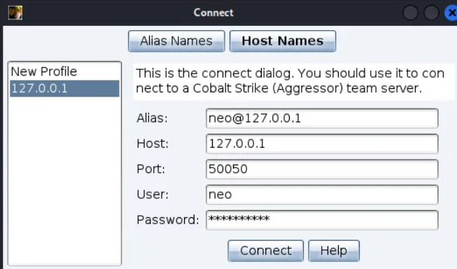
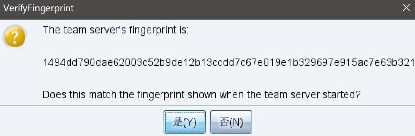
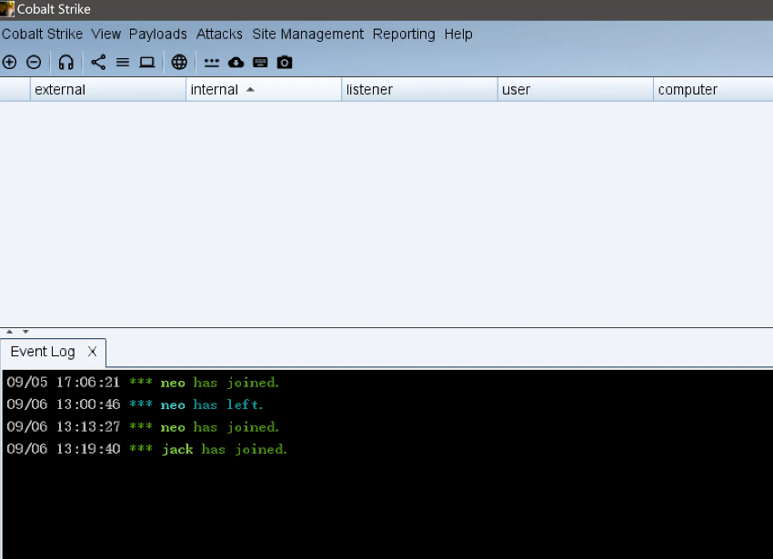

Cobalt Strike基于Java环境开发，所以如果要使用这个工具一定要安装Java环境。（工具的组成为服务端 + 客户端）

Cobalt Strike4.8

        服务端  
启动Cobalt Strike需要JDK的支持，所以需要安装Java环境，如果服务端是kali，默认安装了java环境  
文件复制进linux服务器  
执行ls -l 查看TeamServer跟TeamServerImage是否有执行权限  
如果TeamServer跟TeamServerImage不具备x执行权限，执行如下命令添加执行权限  
sudo chmod +x teamserver TeamServerImage  
启动服务端：  
sudo ./teamserver 192.168.80.146 cspasswd.9  
这里填本机ip地址跟密码,默认端口为50050  

        客户端  
windows运行客户端，也需要有JDK环境  
运行cobaltstrike-client.cmd文件  
输入对应服务端上设置的Host Port User Password  
  
Alias：输入主机别名或使用默认值，不能为空或以*开头。  
Host：指定团队服务器的IP地址，不能为空  
Port：服务器的端口（默认为50050）  
User：你在团队服务器上的昵称，不能为空。  
Password：连接到服务器的密码  

第一次用连接到此团队服务器, 会弹出确认指纹  
Cobalt Strike将询问你是否识别此团队服务器的SHA256哈希,指纹校验的主要作用是防篡改  
点击是,连接登录到服务端并打开客户端用户界面  
  

如果连接不上，查看服务端防火墙是否开启默认端口或者指定的端口  
  
Cobalt Strike将会记住这个SHA256哈希值,以便将来连接.可以通过Cobalt Strike -> Preferences -> Fingerprints 来管理这些哈希值。  

杀毒软件查杀方式：特征码、动态查杀、云查杀  

免杀：隐藏特征码、配置Nginx反向代理  