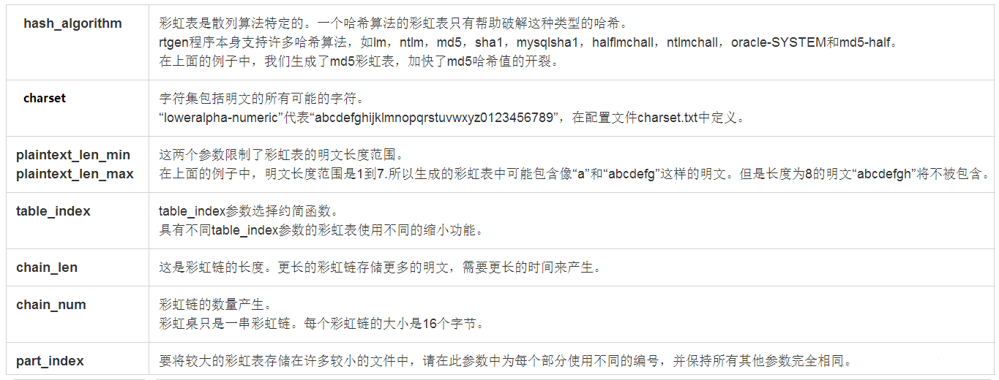

#### 介绍
彩虹表是一个预先计算好的，用于破解hash密码的文件。它和暴力破解相比，使用更大的存储空间，但是破解时间较短；和简单的散列查找相比，使用时间较长，但是存储空间少  

#### 原理
彩虹表存储预先计算好的hash chain。例如 P代表可能的密码集合，Q是hash后的集合，即Q=H(P); R代表reduction function(缩减函数)，即将hash值转变成一个key。彩虹表的生成过程如下：  

先随机生成一个p0，对p0进行一次H(hash)操作，然后再R(reduction)操作，再H，形成一条hash chain，即过程如下：  
p0-H->q1-R->p1-H->q2-R->p2-.....-H->q(n-1)-R->p(n-1)-H->qn-R->pn  
表中会存在很多这种hash chain，比如对q(与查询的hash值)进行破解，会对p进行一次R操作，及p-R->c1 (结果记成c1)，拿c1和pn进行比较(即和一条链的终点进行比较)，若相等，则找到这条链的起点p0，查找这条链，直到找到q，破解后的密码就是p(n-1)。有时候从起点进行查找，找不到q，原因可能是在碰撞点进行了合并。  

以RainbowCrack为例破解hash，RainbowCrack是一款实用的hash破解工具，它基于预先生成的各种散列类型的彩虹表，并支持GPU加速（包括AMD和英伟达）

#### RainbowCrack目录文件说明：  
            文件              作用

            rtgen        生成彩虹表的执行文件

            rtsort       给彩虹表排序文件

            rcrack       执行解密的文件

            rt2rtc       将后缀是rt的文件转化为rtc文件

            rtc2rt       将后缀是rt的文件转化为rt文件

            charset      这个文件是我们的字符集对照表文件(解密的类型)

            group        这是组文件.将几个彩虹表组合起来

#### RainbowCrack的基本使用流程：
      创建彩虹表（使用rtgen工具）；---对彩虹表进行排序（使用rtsort工具）；---开始真正的hash破解过程（使用rcrack工具）

      生成彩虹表：所谓生成彩虹表就是生成对应的hash字典，通过跑hash字典来完成相应的hash的值。

rtgen md5 mixalpha-numeric 1 9 112 577000 268435456 100

#### RainbowCrack rtgen 参数注解
生成彩虹表格式:  
`rtgen hash_algorithm charset plaintext_len_min plaintext_len_max table_index chain_len chain_num part_index`  
翻译如下:  
rtgen 哈希类型 字符范围 最小位数 最大位数 表索引 链长度 链数量 索引块  

rtgen工具的参数解释如下：  

      hash_algorithm      指定生成的彩虹表对应的hash类型,不同hash类型的彩虹表只能用于破解对应类型的hashcharset             明文所使用的字符集范围,比如,大小写字母,数字,特殊字符等等...
      charset		    指定明文所使用的字符集范围,比如,大小写字母,数字,特殊字符等等
      plaintext_len_min   指定明文密码最小长度
      plaintext_len_max   指定明文密码最大长度,它会按所你给定的长度,来生成hash,范围越大,组合自然就越多,彩虹表也就会越大 
      table_index         表索引,压缩算法,参考论文:https://lasec.epfl.ch/pub/lasec/doc/Oech03.pdf
      chain_len           每一个彩虹连的附加信息,基础长度位16byte,这里越长存储的加速信息就越多,速度就越快
      chain_num           彩虹连的总数量,每一个彩虹连长度固定为16byte
      part_index          针对超大彩虹表的分卷标记,0:不分卷[比如有很多单文件,它们就是靠这个标示来判断是否属于同一个彩虹表]

  

      hash_algorithm：彩虹表对应的算法类型：
            lm, ntlm, md5, sha1, mysqlsha1, halflmchall, ntlmchall, oracle-SYSTEM and md5-half

      charset: 明文所使用的字符集范围：/usr/share/rainbowcrack/charset.txt
            例如loweralpha-numeric->abcdefghijklmnopqrstuvwxyz0123456789.定义在文件charset.txt中
            numeric            = [0123456789]
            alpha              = [ABCDEFGHIJKLMNOPQRSTUVWXYZ]
            alpha-numeric      = [ABCDEFGHIJKLMNOPQRSTUVWXYZ0123456789]
            loweralpha         = [abcdefghijklmnopqrstuvwxyz]
            loweralpha-numeric = [abcdefghijklmnopqrstuvwxyz0123456789]
            mixalpha           = [abcdefghijklmnopqrstuvwxyzABCDEFGHIJKLMNOPQRSTUVWXYZ]
            mixalpha-numeric   = [abcdefghijklmnopqrstuvwxyzABCDEFGHIJKLMNOPQRSTUVWXYZ0123456789]
            ascii-32-95                  = [ !"#$%&'()*+,-./0123456789:;<=>?@ABCDEFGHIJKLMNOPQRSTUVWXYZ[\]^_`abcdefghijklmnopqrstuvwxyz{|}~]
            ascii-32-65-123-4            = [ !"#$%&'()*+,-./0123456789:;<=>?@ABCDEFGHIJKLMNOPQRSTUVWXYZ[\]^_`{|}~]
            alpha-numeric-symbol32-space = [ABCDEFGHIJKLMNOPQRSTUVWXYZ0123456789!@#$%^&*()-_+=~`[]{}|\:;"'<>,.?/ ]

#### 生成彩虹表  
现在，我们以10位纯数字为例来生成自己的彩虹表，并可以权衡破解速度和存储空间。  

      # 生成一个包含1~10位数字，链长128，链数67108864 的彩虹表
      rtgen md5 numeric 1 10 1 128 67108864 0

      # 对生成的彩虹表进行排序
      rtsort md5_numeric#1-10_1_128x67108864_0.rt

##### 大小说明：
      彩虹表文件大小=chain_num * 16byte​  
      链数 67108864 * 16byte = 1GB，因此生成的彩虹表（md5_numeric#1-10_1_128x67108864_0.rt）的大小为 1GB。

#### 其他说明：
      彩虹表的生成需要非常强的计算能力，可以使用多核CPU或GPU来提高速度；
      生成上面的使用的彩虹表（一个），在24核60G服务器耗时约1.5min（CPU使用率 2300%）；4核8G渣渣开发机耗时10min（CPU使用率390%）；
      本次测试中暂时未发现内存大小对速度性能造成的影响；

#### 使用彩虹表破解  
我们以一批随机的10位数字ID进行测试，样本数据共59293个，进行破解：

      # wax_uid.txt是需要破解的数据，每行一个
      rcrack md5_numeric#1-10_1_128x67108864_0.rt -l wax_uid.txt
      
      
      # 结果
      statistics
      -------------------------------------------------------
      plaintext found:                              28336 of 59293
      total time:                                   53.76 s
      time of chain traverse:                     12.67 s
      time of alarm check:                        2.85 s
      time of wait:                               20.64 s
      time of other operation:                    17.60 s
      time of disk read:                            33.52 s
      hash & reduce calculation of chain traverse:  478138752
      hash & reduce calculation of alarm check:     91928521
      number of alarm:                              2375649
      speed of chain traverse:                      37.75 million/s
      speed of alarm check:                         32.22 million/s

      可以大概算出：
            单表成功率：47.8%；
            每个破解耗时（整体）：0.9067ms
            每个破解耗时（成功）：1.8972ms

#### 提高破解概率  
单表的破解概率为 47.8%，如果我们需要将破解概率提高到**95%，**则需要5个彩虹表（计算：1 – (1 – 0.478)5 = 0.9612）  

      # 生成5个彩虹表，其中 table_index 指定不同的参数
      rtgen md5 numeric 1 10 1 128 67108864 0
      rtgen md5 numeric 1 10 2 128 67108864 0
      rtgen md5 numeric 1 10 3 128 67108864 0
      rtgen md5 numeric 1 10 4 128 67108864 0
      rtgen md5 numeric 1 10 5 128 67108864 0
      
      # 对彩虹表进行排序
      rtgen *.rt

再进行一次破解，结果如下：

      # *.rt 包含了上面生成的5个彩虹表
      rcrack *.rt -l wax_uid.txt
      
      
      # 结果
      statistics
      -------------------------------------------------------
      plaintext found:                              56947 of 59293
      total time:                                   140.48 s
      time of chain traverse:                     32.23 s
      time of alarm check:                        5.56 s
      time of wait:                               49.94 s
      time of other operation:                    52.75 s
      time of disk read:                            134.54 s
      hash & reduce calculation of chain traverse:  1191802752
      hash & reduce calculation of alarm check:     185569273
      number of alarm:                              4795196
      speed of chain traverse:                      36.97 million/s
      speed of alarm check:                         33.38 million/s

      可以大概算出：
            整体成功率：96.04%；
            每个破解耗时（整体）：2.3692ms
            每个破解耗时（成功）：2.4669ms